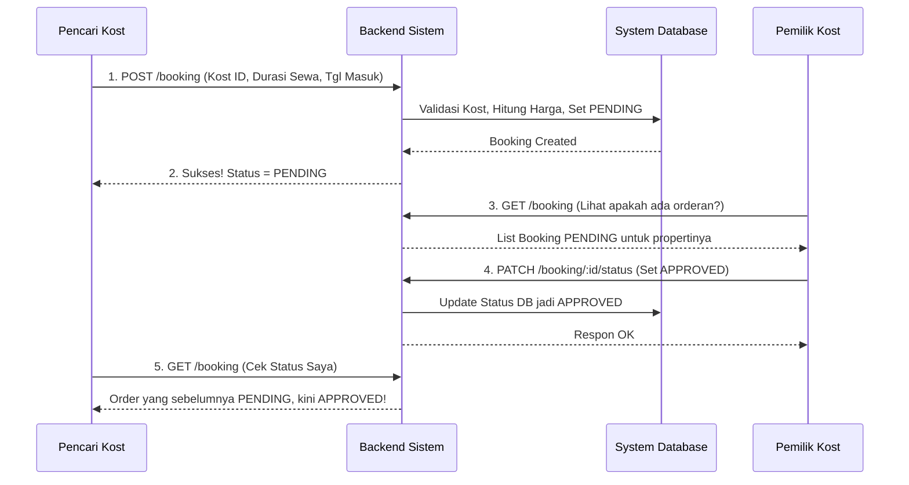

# 🔄 Workflow & Cara Kerja Aplikasi Sewa Kost

Dokumen ini mendeskripsikan secara komprehensif alur kerja (workflow) dari sistem Backend Kost App. Aplikasi ini melayani dua pihak yang terpisah: **Pencari Kost** dan **Pemilik Kost**. 

Arsitektur aplikasi akan menangani dan membatasi (*Role-Based Access Control*) apa saja yang berhak dilakukan oleh setiap peran.

---

## 1. Alur Autentikasi (Semua Pengguna)
Ini adalah siklus awal sebelum interaksi dengan sistem tertutup.
1. **Pendaftaran (Register)**: Pengguna mendaftar sistem minimal menggunakan email, dan password. Saat mendaftar, mereka mendonasikan tipe pengguna, yaitu akan menjadi **PENCARI** atau **PEMILIK**.
2. **Masuk (Login)**: Pengguna melakukan autentikasi. Sistem (NestJS Auth Module) mengecek database.
3. **Tokenisasi (JWT)**: Jika kredensial sesuai, Backend akan mengembalikan `Access Token` (JWT). Token ini menjadi kunci akses ("Pass ID") yang disisipkan di *Header* setiap kali melakukan panggalian API private.

---

## 2. Alur "Pemilik Kost" (Role: PEMILIK)
Pemilik Kost adalah manajemen murni yang mempublikasi properti dan menunggu prospek/penyewa.

1. **Memposting Iklan Kost**: Menggunakan endpoint API manajemen, Pemilik mendaftarkan nama properti, harga per-bulan, detail alamat, fasilitas unggulan, hingga kumpulan gambar/foto kost.
2. **Mengelola Properti Kost**: Pemilik dapat kapanpun melakukan edit (harga/fasilitas) atau bahkan menghapus kost dari listing publik jika sudah tidak ingin mendatangkan penyewa baru.
3. **Konfirmasi Pemesanan (Booking)**:
   - Apabila ada pencari kost yang berniat memesan/booking kamar di propertinya, pesanan tesebut akan masuk ke antrean dengan status awal `PENDING`.
   - Pemilik wajib melakukan moderasi, yaitu Mengkonfirmasi/Menerima kesepakatan (`APPROVED`), atau Menolaknya mungkin dengan alasan telah penuh (`REJECTED`).

---

## 3. Alur "Pencari Kost" (Role: PENCARI)
Pencari Kost bertindak layaknya pembeli (*customer*). Endpoint eksplorasi kebanyakan bersifat bebas akses (*public*).

1. **Eksplorasi (Search & Discover)**:
   - Pencari kost dapat melihat-lihat daftar kost yang tersedia meskipun *mereka belum login*.
   - Mereka seringkali memfilter berdasarkan kriteria (contoh: "Tampilkan di kota Bandung dengan harga maksimal Rp 2.000.000").
2. **Cek Detail**: Memeriksa kelengkapan, membaca deskripsi fasilitas menyeluruh serta melihat kumpulan foto asrama dari detail ID kost tertentu.
3. **Membuat Pesanan (Checkout/Booking)**:
   - Setelah sepakat dan tertarik, Pencari harus login (*memiliki Token*).
   - Mengirim permintaan booking berupa **Tanggal Masuk** dan **Durasi Berapa Bulan** menyewa.
   - Sistem backend akan secara otomatis menghitung *Total Harga* (Durasi Sewa * Harga Kost per-Bulan) untuk menghindari manipulasi harga dari sisi *Frontend*.
4. **Melihat Status Riwayat**:
   - Pencari dapat melihat list riwayat transaksinya. Apakah sedang berstatus negosiasi/menunggu pemilik merespon (`PENDING`), sukses diterima (`APPROVED`), gagal atau dibatalkan (`REJECTED` / `CANCELLED`).

---

## 4. Diagram Alur Transaksi Pemesanan

Berikut adalah interaksi komunikasi antara Pencari, Sistem, dan Pemilik secara berurutan:

---

## 5. Security & Rule System
Sistem harus memastikan keamanan transaksi lewat pendelegasian otorisasi otomatis:
- Endpoints modifikasi seperti **Membuat Kost Baru** akan divalidasi oleh `@RolesGuard(PEMILIK)` di NestJS. Pengguna pencari tidak bisa iseng membuat kost fiktif.
- **Isolasi Data**: Saat Pencari Kost mengakses `GET /booking`, API hanya mengembalikan data transaksi spesifik milik ID Pencari tersebut . Sebaliknya, apabila yang mengakses adalah Pemilik Kost, maka SQL di backend hanya mengambil daftar Booking yang bersinggungan erat dengan `ownerId` miliknya. 

**Workflow Plan Ini bersifat Dokumen Sentral.** Setiap logika/algoritma di tingkat level API akan tunduk pada proses bisnis dokumen ini.
